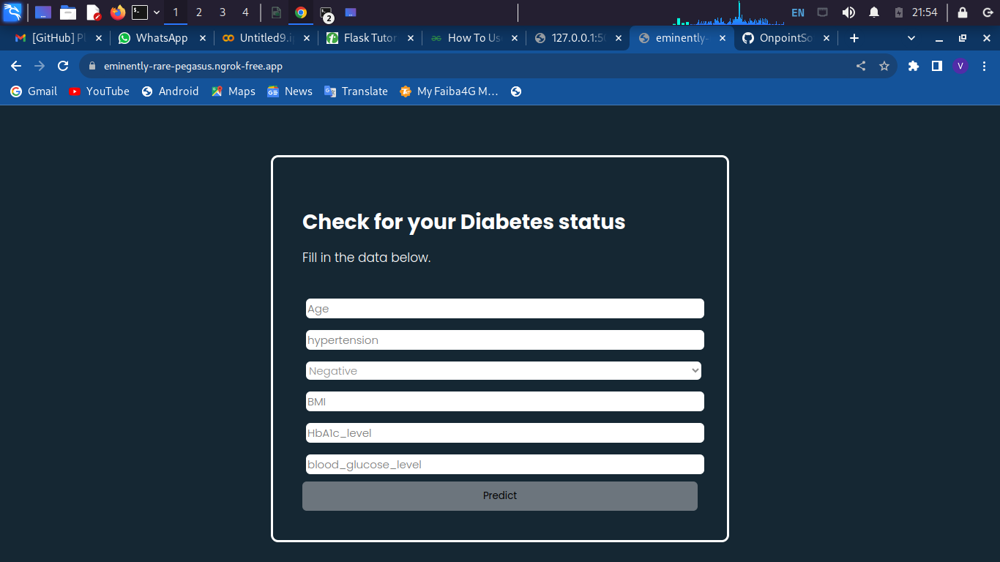

# Diabetes Prediction System

## Overview

Welcome to the Diabetes Prediction System project! This system aims to predict the likelihood of an individual having diabetes based on various health-related features. It utilizes machine learning algorithms to analyze input data and provide predictions, aiding in early diagnosis and proactive healthcare.

## Features

- **Machine Learning Prediction:** Leverages advanced machine learning algorithms to predict the likelihood of diabetes based on input features such as glucose levels, BMI, age, etc.

- **User-friendly Interface:** Provides a simple and intuitive interface for users to input their health data and receive predictions.

- **Health Data Analysis:** Utilizes historical health data to identify patterns and correlations, enhancing the accuracy of predictions.

- **Data Privacy:** Prioritizes the privacy and security of user health data, adhering to best practices and compliance with relevant regulations.

## Screenshots


*Caption: User-friendly interface for inputting health data.*


*Caption: Predicting diabetes likelihood based on user input.*

## Getting Started

### Prerequisites

- [Python](https://www.python.org/) installed
  -[Flask]() installed
- [pip](https://pypi.org/project/pip/) (Python package installer) installed

### Installation

1. Clone the repository:

```bash
git clone https://github.com/OnpointSoftwares/Diabetes-Prediction-Using-Random-Forest-Classifier
